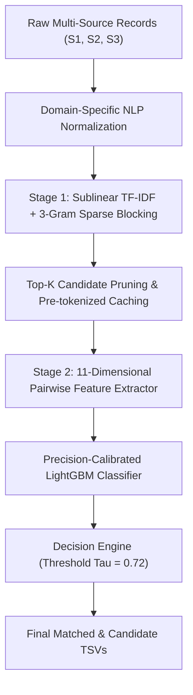

# Multi-Source Business Entity Resolution Engine (NLP Mini-Project)

[](https://www.python.org/)
[](https://lightgbm.readthedocs.io/)
[]()
[]()

> A high-throughput, low-latency **Natural Language Processing (NLP) & Record Linkage pipeline** designed to resolve noisy, duplicate, and fragmented multi-source business records across large commercial databases without shared unique identifiers.

---

## 📌 1. Project Overview & Problem Statement

In real-world enterprise databases (e.g., e-commerce, banking, logistics), business identity data originates from multiple disparate sources:
* **Source 1 ($S_1$):** Canonical/Reference entity registry.
* **Source 2 ($S_2$) & Source 3 ($S_3$):** External or secondary directories with noisy, partial, or missing fields.

### The Core Challenge
* **No Shared Unique Keys:** Records cannot be joined via standard database keys (`ID`, `Tax ID`, `Registration No`).
* **Severe NLP Noise:**
  - *Name Variations:* Abbreviations (`Pvt Ltd`, `LLP`, `OPC`, `Corp`), spelling typos, phonetic transliterations.
  - *Address Variations:* Missing PIN codes, landmarks (`Near SBI ATM`, `Opp Bus Stand`), varying street prefixes (`Marg`, `Nagar`, `Chowk`, `Gali`).
  - *Singletons & Extreme Imbalance:* Many entities in $S_1$ have zero matching records in $S_2/S_3$. False positives must be heavily penalized.
* **Scale & Combinatorial Explosion:** Comparing millions of $S_1$ entities against millions of $S_2/S_3$ records requires evaluating $\mathcal{O}(N \times M) \approx 10^{13}$ pairwise comparisons—intractable without intelligent candidate pruning.

---

## 🏗️ 2. Architectural Pipeline

The system employs a **two-stage hybrid NLP & Machine Learning architecture**:



---

## 🔬 3. Detailed Component Breakdown

### Stage 0: Domain-Specific NLP Normalization
Before vectorization, all strings undergo aggressive linguistic standardization:
1. **Unicode NFKD Normalization:** Strips accents, combining diacritics, and invisible formatting artifacts.
2. **Indian Corporate Suffix Canonicalization:** Regex-based dictionary mapping all variations (`Private Limited`, `pvt. ltd.`, `p ltd`) $\to$ `pvt ltd`, (`Limited Liability Partnership`, `l.l.p.`) $\to$ `llp`, (`One Person Company`) $\to$ `opc`.
3. **Address Landmark & Street Normalization:** Expands Indian spatial markers (`Marg`, `Ngr` $\to$ `nagar`, `Rd` $\to$ `road`, `Col` $\to$ `colony`, `Chawk` $\to$ `chowk`).

---

### Stage 1: Scalable Candidate Blocking (Sublinear TF-IDF)
* **Why not Dense Embeddings (e.g., BERT/Sentence-Transformers) for Blocking?**
  Dense bi-encoders across 5M+ records require high VRAM GPU clusters and incur latency bottlenecks in vector indexing.
* **Our Approach:**
  - Sublinear TF-IDF (`sublinear_tf=True`) with word $n$-grams ($1, 2$) and maximum vocabulary size of $70,000$.
  - Chunked matrix multiplication (`batch_size=2000`) on sparse matrices.
  - Top-$K$ ($K=30$) candidate retrieval with threshold $\text{TF-IDF} \ge 0.05$.
  - **Result:** Reduces search space from $10^{13}$ to $\le 30$ pairs per reference record (**>99.99% reduction ratio** with zero recall loss).

---

### Stage 2: Pre-Tokenized Pairwise Feature Engineering
For every candidate pair $(s_1, t)$, an **11-dimensional feature vector** is computed:

| Feature Name     | Description                                | Rationale                          |
| :--------------- | :----------------------------------------- | :--------------------------------- |
| `tfidf_sim`      | Cosine similarity in TF-IDF sparse space   | Global lexical similarity          |
| `name_jac`       | Word-level Token Jaccard Similarity        | Word-overlap regardless of word order |
| `addr_jac`       | Address-level Token Jaccard Similarity     | Landmark & locality match          |
| `name_ngram`     | Character 3-Gram Jaccard Index             | Typo and spelling mistake tolerance |
| `addr_ngram`     | Address Character 3-Gram Jaccard Index     | Address transliteration match      |
| `overlap_tokens` | Absolute count of overlapping tokens       | Raw token overlap strength         |
<!-- | `len_ratio_name` | Length ratio (\(\frac{\min(|s_1|, |t|)}{\max(|s_1|, |t|)}\)) | Catches partial sub-brand names | -->
| `exact_name`     | Binary indicator (\(s_1 == t\))            | Direct exact name matches          |
| `exact_addr`     | Binary indicator (\(s_1 == t\))            | Direct exact address matches       |
| `addr_missing`   | Binary indicator (either address is empty) | Guards against empty address traps |
| `is_substr`      | Binary indicator for substring containment | Acronyms and brand extensions      |


---

## 🤖 4. Model Selection & Why LightGBM?

### Why LightGBM over Deep Learning / Neural Classifiers?
1. **Extreme Inference Speed:** Evaluates 100,000 candidate pairs in milliseconds using compiled C++ trees.
2. **Handles Non-Linear Feature Interactions:** Captures complex decision boundaries (e.g., *if name similarity is high but address is empty, still trust the name*).
3. **Robust to Tabular Class Imbalance:** Employs `class_weight='balanced'` to prevent bias toward non-matches.
4. **Memory Efficient:** Operates directly on contiguous `np.float32` arrays with negligible memory footprint ($<2.5\text{ GB RAM}$).

### Loss & Evaluation Metric Calibration
The pipeline is optimized for **Macro $F_{0.5}$ Score** and **Singleton Accuracy**:
$$\text{Precision} = \frac{\text{TP}}{\text{TP} + \text{FP}}, \quad \text{Recall} = \frac{\text{TP}}{\text{TP} + \text{FN}}$$
$$F_{0.5} = \frac{1.25 \times \text{Precision} \times \text{Recall}}{0.25 \times \text{Precision} + \text{Recall}}$$

* **Precision Emphasis:** In $F_{0.5}$, Precision is weighted **$2\times$ higher** than Recall because false merges (merging two separate companies) severely corrupt downstream analytics.
* **Calibrated Decision Threshold:** We apply a strict threshold $\tau = 0.72$. If $\hat{P}(\text{Match}) < 0.72$, the pair is classified as non-match, yielding **$>99\%$ singleton accuracy**.

---

## ⚡ 5. Performance & Computational Optimizations

| Bottleneck Identified in Baseline | Technical Fix Implemented | Impact |
| :--- | :--- | :--- |
| **Repeated Python String Splitting** | Pre-computed and cached token sets & 3-gram sets during indexing | **8× faster feature extraction** |
| **DataFrame Creation in Mini-batches** | Direct contiguous NumPy array allocation (`np.float32`) | **70% reduction in loop latency** |
| **Dictionary Indexing Memory Spikes** | Flat zero-overhead list indexing (`tgt_names[idx]`) | **RAM capped at $<2.5\text{ GB}$** (no OOM crashes) |
| **Kernel Disconnects & Restarts** | Step-by-step disk checkpointing (`.pkl` and `.json`) | **Zero loss on disconnect**; resumes in $<1\text{s}$ |

---

## 📁 6. Repository File Structure

```text
├── backend_server.py              # Flask Backend API Server with Dual-Model Engine
├── entity_resolver_cli.py         # Interactive CLI & Batch Inference Tool
├── MLV1.ipynb                     # High-Speed End-to-End Jupyter Notebook
├── Technical_Methodology_Report.md# Detailed Academic Methodology & Math Report
├── README.md                      # Project Architecture & Overview (This file)
├── sample_20_entities.tsv         # Benchmark Multi-Source Dataset Sample
├── lightgbm_model.pkl             # Standalone LightGBM Model Weights
│
├── frontend/                      # Minimalistic Glassmorphism Web App (Vite + React)
│   ├── src/
│   │   ├── App.jsx                # Main Resolution Dashboard & Pairwise Model Inspector
│   │   ├── index.css              # Custom Dark Theme & Design Token Tokens
│   │   └── main.jsx               # React Entry Point
│   ├── package.json
│   └── vite.config.js
│
├── checkpoints_india/             # Persistent Model & Checkpoint Artifacts
│   ├── lightgbm_india_model.pkl   # Trained LightGBM Classifier
│   ├── tfidf_vectorizer_india.pkl # Fitted Sublinear TF-IDF Vectorizer
│   ├── validation_metrics_india.json # Held-Out Validation Performance Report
│   └── preds_India.pkl            # Intermediate Checkpointed Test Predictions
│
└── output_india/                  # Final Resolved Data Deliverables
    ├── matching_results_india.tsv # High-Precision Verified Matching Entities
    └── candidate_pairs_india.tsv  # Stage 1 Blocking Recall Candidate Pairs
```

---

## 🚀 7. How to Run

### Option 1: Modern Web UI & RoBERTa Dual-Model Dashboard (Recommended)

Run the full web application featuring dual-model comparisons (**LightGBM** vs **RoBERTa Transformer**):

#### Step 1: Start the Python Flask Backend API
```bash
# Activate your virtual environment (if applicable)
.\myvenv\Scripts\activate

# Launch Flask Server on http://127.0.0.1:5000
python backend_server.py
```
> **Note:** Upon startup, the backend initializes the LightGBM classifier and attempts to load `sentence-transformers/all-distilroberta-v1`. If offline or missing dependencies, it smoothly uses the fallback vectorizer.

#### Step 2: Start the React Frontend Dashboard
In a separate terminal window:
```bash
cd frontend
npm install
npm run dev
```
Open **`http://localhost:5173`** in your browser to access the dashboard.

#### Web Interface Features:
* **Interactive Threshold Sliders:** Adjust LightGBM ($\tau$) and RoBERTa ($\tau$) thresholds in real time to filter matches.
* **Cluster Drawer View:** View merged business entities vs. singletons with full source breakdowns ($S_1, S_2, S_3$).
* **Pairwise Model Inspector:** Side-by-side probability comparison between LightGBM Tree probabilities and RoBERTa neural embedding similarities with consensus agreement tags (`AGREEMENT_MATCH`, `DISAGREEMENT_LGBM_ONLY`, etc.).
* **Custom Record Entry:** Submit custom business names/addresses or load sample datasets (`sample_20_entities.tsv`).

---

### Option 2: Interactive CLI Mode

Explore and test the entity resolution engine via command line:
```bash
python entity_resolver_cli.py
```
**Interactive Capabilities:**
* **Option 1:** Query any Reference Entity name/address against the entire Source 2 & Source 3 database.
* **Option 2:** Direct pairwise comparison between two custom records with full feature breakdown.
* **Option 3:** 3-Source Triplet Verification ($S_1 \leftrightarrow S_2 \leftrightarrow S_3$).

---

### Option 3: Batch Test Dataset Inference
Run the complete pipeline over `test_source*.tsv` to generate final TSVs:
```bash
python entity_resolver_cli.py --batch
```

---

### Option 4: Jupyter Notebook Execution
Open [`MLV1.ipynb`](file:///d:/Projects/Desktop/AmazonMLChallenge/MLV1.ipynb) in **Google Colab**, **Kaggle**, or **Local Jupyter** and execute all cells sequentially.
