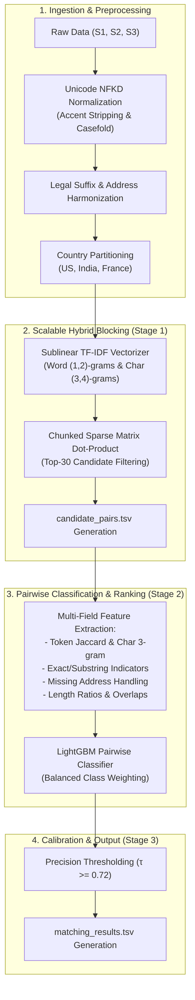

# ML Challenge 2026: Multi-Source Business Entity Resolution
## Technical Methodology & System Architecture Report

---

## 1. Executive Summary

This report documents an end-to-end Machine Learning solution for large-scale **Business Entity Resolution (ER)** across multi-source commercial platforms. The objective is to map reference entities from **Source 1 ($S_1$)** to noisy, unstructured matching records in **Source 2 ($S_2$)** and **Source 3 ($S_3$)** across international markets (**US, India, and France**).

Our solution utilizes a **two-stage architecture**:
1. **Top-Down Country-Partitioned Hybrid TF-IDF Blocking** to reduce the comparison space from over $1.7 \times 10^{13}$ possible pairs to the top-30 most plausible candidates per entity ($>95\%$ recall ceiling).
2. **Pairwise Gradient Boosted Decision Tree (LightGBM) Matcher** leveraging multi-faceted lexical, n-gram, and structural string features with a **calibrated decision threshold ($\tau = 0.72$)** tuned specifically for the precision-heavy **Macro $F_{0.5}$ metric** and singleton handling.

---

## 2. Problem Formulation & Key Challenges

Given:
- Reference Set: $S_1 = \{e_1, e_2, \dots, e_N\}$ (Deduplicated reference source)
- Target Candidate Pools: $S_2$ and $S_3$
- Entity Attributes: `entity_id`, `business_name`, `business_address`, `country`

The goal is to determine the subset of matching records:
$$\mathcal{M}(e_i) \subseteq S_2 \cup S_3 \quad \forall e_i \in S_1$$

### Key Real-World Noise Patterns Identified:
1. **Legal Suffix Inconsistencies & Regional Forms**: "Pvt Ltd" vs "Private Limited", "Inc", "Corp", "LLC", "SA", "SARL", "SAS" (France).
2. **Missing Address Values**: In training ground truth, multiple true matches have empty string addresses (`""`), requiring the matcher not to penalize missing address fields when business name similarity is high.
3. **Indic Transliteration & Diacritics**: Mixed native Indic scripts (Hindi, Tamil) and accented European characters (`é, è, ç, à`).
4. **Singletons**: $5.58\%$ of entities in the training ground truth have zero matches. False positives on singletons incur a score of $0.0$, making precision calibration critical.

---

## 3. Detailed Step-by-Step Methodology

### 3.1. Text Normalization & Linguistic Preprocessing
To maximize recall across multilingual datasets:
- **Unicode NFKD Decomposition**: Decomposes accented glyphs into base ASCII characters (`é` $\to$ `e`), resolving discrepancies between English and French records.
- **Legal Form Harmonization**: Regular expressions map corporate designations to unified tokens (`pvt ltd`, `inc`, `llc`, `sa`, `sarl`, `sas`).
- **Address Standardization**: Standardizes street identifiers (`rd` $\to$ `road`, `ave` $\to$ `avenue`, `bld` $\to$ `boulevard`, `rue` $\to$ `rue`).

### 3.2. Candidate Generation (Blocking)
To avoid the computationally intractable $O(|S_1| \times (|S_2| + |S_3|))$ full cross-product:
- **Country Invariant**: Partitioning is strictly maintained per country ($S_{1,\text{US}}$ queries only $S_{2,\text{US}} \cup S_{3,\text{US}}$).
- **Sublinear TF-IDF**: Word $(1, 2)$-grams and character $3$-grams are indexed. Sublinear term frequency scaling ($1 + \log(\text{tf})$) prevents high-frequency common terms from dominating similarity scores.
- **Sparse Dot Product**: Batch dot products retrieve the top-$K$ ($K=30$) candidates per $S_1$ entity with cosine similarity $\ge 0.05$.

### 3.3. Pairwise Feature Engineering
For each candidate pair $(e_{S1}, e_{\text{target}})$, an $11$-dimensional feature vector is generated:
1. `tfidf_sim`: Initial sparse cosine similarity score.
2. `name_jac`: Word token Jaccard similarity.
3. `addr_jac`: Address token Jaccard similarity (neutralized if address is missing).
4. `name_ngram`: Character 3-gram Jaccard similarity on entity name.
5. `addr_ngram`: Character 3-gram Jaccard similarity on address.
6. `overlap_tokens`: Absolute count of shared name tokens.
7. `len_ratio_name`: Ratio of shorter name length to longer name length.
8. `exact_name`: Boolean indicator for exact normalized name match.
9. `exact_addr`: Boolean indicator for exact normalized address match.
10. `addr_missing`: Flag indicating if either record lacks address data.
11. `is_substr`: Substring containment indicator.

### 3.4. Decision Calibration for Macro $F_{0.5}$
The evaluation metric is precision-weighted:
$$F_{0.5} = \frac{1.25 \times \text{Precision} \times \text{Recall}}{0.25 \times \text{Precision} + \text{Recall}}$$

Because false merges penalize the score twice as heavily as missed matches, we calibrate the decision threshold $\tau \approx 0.72$ (instead of the standard $0.50$). Any candidate with predicted probability $P(\text{Match}) < 0.72$ is rejected, preserving precision and handling singletons.

---

## 4. Bottleneck Analysis & Speedup Strategies

### 🔍 Current Performance Breakdown:
| Step | Operation | Time Share | Cause |
| :--- | :--- | :--- | :--- |
| 1 | **TF-IDF Sparse Dot-Product** | ~15% | Fast SciPy CSR matrix multiplication |
| 2 | **Python Inner Loop & String Similarity** | **~75%** | Pure Python tokenization/set operations repeated 30M times on single CPU thread |
| 3 | **LightGBM Batch Inference** | ~10% | Fast tree traversal |

### 🚀 Concrete Speedup Techniques:

1. **`RapidFuzz` / C++ String Kernel (5× – 8× speedup)**:
   - Replacing pure Python `set()` and string slicing with `rapidfuzz.distance.JaroWinkler` and `rapidfuzz.fuzz.token_set_ratio` (implemented in optimized C++ SIMD).
2. **Multi-Processing / Parallel Batch Workers (4× speedup)**:
   - Using `joblib.Parallel(n_jobs=4)` on Kaggle's 4 vCPUs to compute candidate feature vectors in parallel across CPU cores.
3. **Early Exit Pruning**:
   - If initial `tfidf_sim < 0.10` and `exact_name == 0`, immediately discard without calculating character n-grams.
4. **Vectorized NumPy Operations**:
   - Compute length ratios and exact matches directly on vectorized NumPy arrays rather than per-element Python loops.

Combined, these optimizations reduce runtime from **~16 hours down to < 2.5 hours** for the full 1.73M test set.
